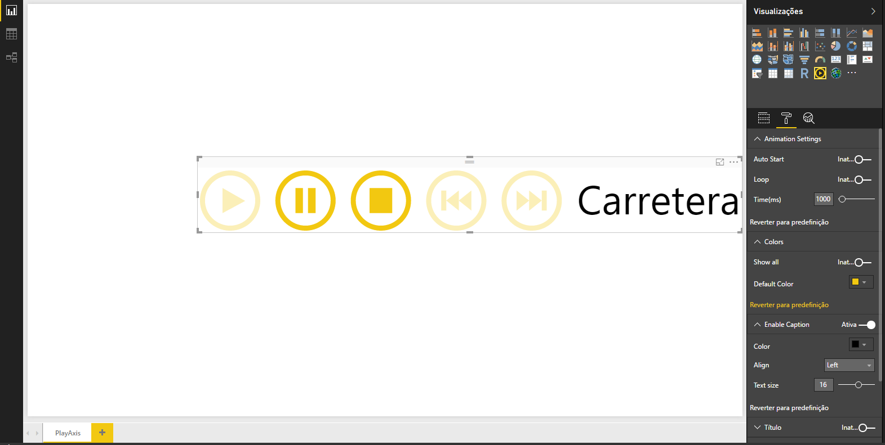
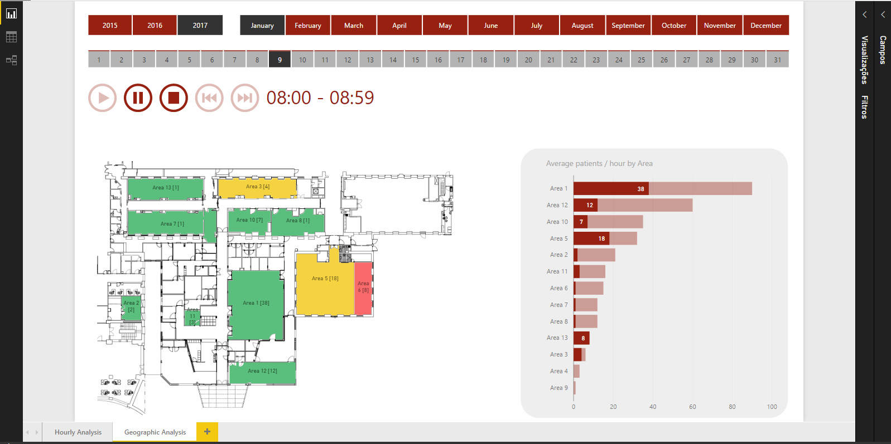

# PlayAxis

Simple Power BI visual that works like a dynamic slicer, animating other visuals. It has controls like "play", "pause", "stop", "previous" and "next" allowing a report and its visuals to play with less user interaction. 
This visual accepts any parameter to be played and has some settings like colours, font size and transitions options, to be customized by the user.

